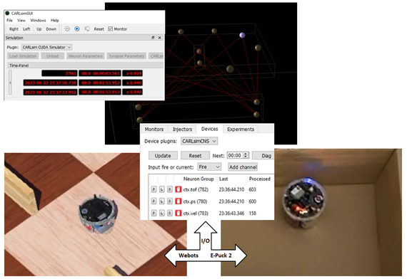

# CARLsim++ 
<!-- Describe what CARLsim++ is and why it uses a YCM super build. -->

CARLsim++ is an integrated toolbox that enables fast and easy creation of neuromorphic applications.
It encapsulates the mathematical intrinsics and low-level C++ programming by providing a graphical user interface 
to create neuromorphic models and Developers can easily configure inputs and outputs to devices and robots. 
These can be accurately simulated before deploying on physical devices. CARLsim++ can lead to rapid development 
of neuromorphic applications for simulation or edge processing.




CARLsim++ is a complex system by design with a modular architecture. 
Neuromophic applications incorporate a huge amount of requirements such as 
realtime processing of sensory input, providing visual feedback of neural activity, 
monitoring operational and scientific data, just to name a few. 
For managing the open-source repositories and to accomplish automatic builds, we utilizes the YCM superbuild. 
YCM was orignally developed by IIT for iCub with the principle, to upstream its generic functions to CMake. 

CARLsim++ was published at [NICE 2024](https://niceworkshop.org/nice-2024/).
Please refer to our [paper](https://doi.org/10.48550/arXiv.2404.08726) for more information and how to cite.


# Building CARLsim++ on Windows
<!-- describe the simpliest way possible. address specifics and options as supplemental remarks -->

The complete CARLsim++ system will be encapsulated in one directory called CARLSIMPP_ROOT.


## Prerequisites

CARLsim++ for Windows is built with the following tool chain: 

* Microsoft Visual Studio 2019 and 2022
* NVIDIA CUDA 11.8
* CMake GUI (>= 3.20)
* Python (>= 3.9)
* Swig 4.0.2  


CARLsim++ uses the following libraries as prerequisites: 

* YCM 16.2  
* Boost 1.76    
* ACE 6.5.20    
* Qt 5.15.13

> Hint: These libraries are matured and a de-facto standard for open source development.
  For convenience, we provide a quick install instructions as supplemental information.   

Required for EPuck simulations and YARP devices: 

* Webots R2023b


## Get CARLsim++  

Clone the CARLsim++ repository to your local disk. 
 
```
cd /d C:\
git clone https://github.com/UCI-CARL/CARLsimPP.git carlsimpp-t01
``` 

The directory of the local CARLsim++ superbuild repository will be referred as CARLSIMPP_ROOT.

> Hint: The directory will contain the full package.
  You can use any root directory as long the path is short.
  Set access rights to full control (File Exporer > Properties > Security).     


> Hint: To build a specific version of CARLsim++, pass the release tag to git clone. 
You also can use an dedicated directory that can used as CARLSIMPP_ROOT.
 
``` 
git clone -b TAG https://github.com/UCI-CARL/CARLsimPP.git carlsim-001
``` 


## Build CARLsim++   

The easiest way to configure and build CARLsim++ is on a single computer
such as a workstation with a NVIDA GPU. 
This is called a single-tier environment. 
See below how to build a 
multi-tier system that functionally seperates components and scales horizontal.   

Preparation 
```
mkdir c:\carlsimpp-t01\build
``` 

Bootstrap the superbuild.

In a Window Command Prompt execute the following commands.  
```
cd /d c:\carlsimpp-t01\build
cmake -A x64 -B . -S .. -DCMAKE_INSTALL_PREFIX="C:/carlsimpp-t01/build/install"
``` 

Build and install all components. 
```
cd /d c:\carlsimpp-t01\build 
cmake --build . --config Debug
```

> Hint: The progress can be monitored with in a Powershell.  
	```
	Get-ChildItem -Path C:\carlsimpp-t01\build -Recurse | Measure-Object -Property Length -Sum
	```

> Hint: If the error LNK2038 occurs during building CARLsim6, 
check in CMakeCache.txt that YCM had set the /W3 and /MDd options.    
	```
	CMAKE_CXX_FLAGS:STRING=/DWIN32 /D_WINDOWS /W3 /GR /EHsc /MP
	```  
	```
	CMAKE_CXX_FLAGS_DEBUG:STRING=/MDd /Zi /Ob0 /Od /RTC1
	```
	

## Configure CARLsim++

To activate the CARLsim++ Superbuild and set its environment variables 
for the current user, open a new Microsoft Powershell and execute  
```
cd c:\carlsimpp-t01\build\install\config
.\activate-superbuild.ps1
```

Open a new Powershell as Administrator and execute
```
cd c:\carlsimpp-t01\build\install\config
.\configure-node.ps1 win-t01-yarp
```

Open a new Powershell for the current your and execute
```
cd c:\carlsimpp-t01\build\install\config
.\setenv-superbuild.ps1 User
.\set-debug.ps1 USER
```

> Hint: On Windows, YARP reports checkpoints to the path C:\Users\user\Documents\yarprun_log.
Create the directory structure with access rights for the current user.


## Run CARLsim++ 

Open the CARLsim++ shortcut in `c:\carlsimpp-t01\build\install\config`

Alternatively, open a new Powershell on the path.  
```
cd c:\carlsimpp-t01\build\install\config
```

To display the configured CARLsim++ system:  
```
.\show-system.ps1
```
 
To start CARLsim++ system:  
```
.\start-system.ps1
```

To stop the CARLsim++ system:  
```
.\stop-system.ps1
```

> Hint: Use the TAB key to autocomplete a Powershell command. 


## Validate the installation for EPuck

Start the CARLsim++ system 
```
.\start-system.ps1
```

Check if the YARP devices for EPuck are available:
```
C:\Users\MyUser>yarpdev --list
[INFO] |yarp.dev.Drivers| Device "CarlEpuck2", available on request (found in C:/carlsimpp-t01/build/install/lib/yarp/yarp_CarlEpuck2.dll library).
[INFO] |yarp.dev.Drivers| Device "CarlWbEPuck", available on request (found in C:/carlsimpp-t01/build/install/lib/yarp/yarp_CarlWbEPuck.dll library).
```


## Configure and build a multi-tier environment

```
cd C:\carlsimpp-001
mkdir build-edge
mkdir build-yarp
mkdir build-gpu
```

```
cd build-epuck
cmake -A x64 -B . -S .. -D<profiles options for edge tier>
```

```
cd buid-yarp
cmake -A x64 -B . -S .. -D<profiles options for yarp tier>
```

```
cd build-gpu
cmake -A x64 -B . -S .. -D<profile options for gpu tier>
```

## Build and configure the Release version of CARLsim++

```
cd c:\carlsimpp-t01\build 
cmake --build . --config Release
```


Open a new Powershell for the current your and execute
```
cd c:\carlsimpp-t01\build\install\config
.\unset-debug.ps1 USER
```


# Prerequisites for CARLsim++ on Windows

## Microsoft Visual Studio 2022

1. Download and follow the install instructions from: 
https://visualstudio.microsoft.com/thank-you-downloading-visual-studio/?sku=Community&channel=Release&version=VS2022&source=VSLandingPage&cid=2030&passive=false

2. Open the "Visual Studio Installer" and choose "Modify". Select the following workloads:
    * "Desktop Development for C++" with "C++/CLI support", "MSVC v142 - VS2019 C+++ x64/x86 build"  
    * "Universal Windows Platform development" with "C++ (V143)/(V142)", "GPU profiler" 
    * "Linux and embedded development with C++" with "Remote File Explorer for Linux"
 
3. Type "Visual Studio 2022" in Windows Search and start it. In the "Help" menu the item "About"
should report version 17.9.4 or later.  

### Futher reading
https://learn.microsoft.com/en-us/cpp/overview/what-s-new-for-visual-cpp-in-visual-studio?view=msvc-170


## Microsoft Visual Studio 2019

1. Download and follow the install instructions from:
https://visualstudio.microsoft.com/vs/older-downloads/#visual-studio-2019-and-other-products

Run the installer vs_community__452194921.1608369874.exe
 
### Further reading
https://learn.microsoft.com/en-us/cpp/overview/what-s-new-for-cpp-2019?view=msvc-170


## NVIDIA CUDA 11.8

1. Download and follow the install instructions from:
https://developer.nvidia.com/cuda-11-8-0-download-archive

2. Select the target platform for a GPU workstation as following: 
Operating System: Windows
Architecture:     x86_64
Version:          11
Installer Type:   exe (local)

3. Download (3.0GB)
https://developer.download.nvidia.com/compute/cuda/11.8.0/local_installers/cuda_11.8.0_522.06_windows.exe

## Further reading
For further information, see the "Installation Guide for Microsoft Windows"
https://docs.nvidia.com/cuda/cuda-installation-guide-microsoft-windows/index.html
and the "CUDA Quick Start Guide"
https://docs.nvidia.com/cuda/cuda-quick-start-guide/index.html.

> Note: NVIDIA CUDA Toolkit no longer supports development or running applications on macOS. 


## CMake GUI

1. Download the binary distribution from https://cmake.org/download/

2. Run the the Windows installer cmake-3.29.0-windows-x86_64.msi	

3. Choose the following install options: 
   * Add CMake to the system PATH 
   * Create CMake Desktop Icon    


## GIT for Widnows, Git Bash

1. Download and follow the install instructions from:
https://github.com/git-for-windows/git/releases/download/v2.44.0.windows.1/Git-2.44.0-64-bit.exe

### Further reading 
A Bash shelll  for Git on Windows
https://gitforwindows.org/


## Perl

Download and install ActivePerl 5.28 from
https://docs.activestate.com/activeperl/5.28/get/windows/

Run ActivePerl-5.28.msi to install Per to C:\Perl64\  

Further reading:
https://www.activestate.com/products/perl/


## Python

Download and install Python 3.7.9 or later from
https://www.python.org/downloads/release/python-379/

```
PYTHON_INCLUDE=C:\Python37\include
PYTHON_LIB=C:\Python37\libs
```

### Further reading 
https://devguide.python.org/versions/


## YCM 

1. Download the sources of YCM 0.16.2 from:   
https://github.com/robotology/ycm/archive/refs/tags/v0.16.2.zip  
  
2. Unpack the .zip to C:\Users\MyUser\Documents\YCM-0.16.2

3. Generate the Visual Studio with CMake GUI:   
   Source:   C:\Users\MyUser\Documents\YCM-0.16.2  
   Build:    C:\Users\MyUser\Documents\YCM-0.16.2\build  
   CMAKE_INSTALL_PREFIX: C:\YCM\YCM-0.16.2  
   
4. Build and Install the Releaes in Visual Studio

5. Define the environment variable YCM_DIR=C:\YCM\YCM-0.16.2

## Further reading
http://robotology.github.io/ycm/gh-pages/latest/manual/ycm-installing.7.html


## ACE

Get ACE and prepare the build:
 
1. Download ACE-6.5.20.zip from [Github](https://github.com/DOCGroup/ACE_TAO/releases/tag/ACE%2BTAO-6_5_20).

2. Unpack the archive to C:\ACE\ACE-6.5.20.

3. Assign the path C:\ACE\ACE-6.5.20\ACE_wrappers to the enviroment variable ACE_ROOT.

To build ACE, follow the install instructions in [ACE-INSTALL.hmtl](file:///C:/ACE/ACE-6.5.20/ACE_wrappers/ACE-INSTALL.html#msvc) 
for MS Visual Studio 2019:

1. Create the file config.h in ACE_ROOT\ace containing following line:    
	   #include "ace/config-win32.h"
	
2. Open Visual Studio 2019 on ACE_ROOT\ACE.sln.   

3. Build the debug and release version for x64.   
	Validate that the lib directory contains files with the naming described in 8.:
	Library/DLL name" + (Is static library ? "s" : "") + (Is Debugging enable ? "d" : "") + {".dll"|".lib"}

4. Add C:\ACE\ACE-6.5.20\ACE_wrappers\bin to the path environment variable.


### Further reading
https://www.dre.vanderbilt.edu/~schmidt/ACE.html


## Qt5
 
We provide a quick install for Qt5 following https://doc.qt.io/qt-5/build-sources.html 
 
1. Get the sources with a Git Bash 
```
git clone git://code.qt.io/qt/qt5.git /C/Qt/Qt-5
cd /C/Qt/Qt-5
git checkout 5.15
./init-repository
```

2. Search for "x64 Native Tools Command Prompt for VS 2019" and open it
```
**********************************************************************
** Visual Studio 2019 Developer Command Prompt v16.11.34
** Copyright (c) 2021 Microsoft Corporation
**********************************************************************
[vcvarsall.bat] Environment initialized for: 'x64'

C:\Program Files (x86)\Microsoft Visual Studio\2019\Community>
```

3. Set the environment variables for configuration and build in the Native Tools Command Prompt:
```
SET _ROOT=C:\Qt\Qt-5
SET PATH=%_ROOT%\qtbase\bin;%_ROOT%\gnuwin32\bin;%PATH%
REM Uncomment the below line when using a git checkout of the source repository
REM SET PATH=%_ROOT%\qtrepotools\bin;%PATH%
SET _ROOT=
```

4. Configure the Qt to build the release version in the Native Tools Command Propmt:
```
cd C:\Qt\Qt-5
configure -release -nomake examples -nomake tests -skip qtwebengine -opensource
```

Validate that the configuration concludes with the following lines:

	Qt is now configured for building. Just run 'nmake'.  
	Once everything is built, you must run 'nmake install'.  
	Qt will be installed into 'C:\Qt\Qt-5.15.13'.  


5. Build and install Qt in the Native Tools Command Prompt:
```
cd C:\Qt\Qt-5
REM set CL=/MP
nmake
nmake install
```

6. Configure and build the debug version of Qt:
```
cd C:\Qt\Qt-5
configure -debug -skip qtwebengine -opensource
```
Repeat the build step. 

7. Add Qt environment variables
```
PATH=%PATH%;C:\Qt\Qt-5.15.13\bin
QT5_ROOT=C:\Qt\Qt-5.15.13
```

### Further reading
See https://wiki.qt.io/Building_Qt_5_from_Git for more information.  

https://github.com/qt/qt5

https://doc.qt.io/qt-5/windows-requirements.html

https://doc.qt.io/qt-5/cmake-manual.html

https://doc.qt.io/qt-5/build-sources.html

https://doc.qt.io/qt-5/windows-building.html

https://github.com/qt/qt5/tree/5.15.2

> Hint: Building Qt5 from git
 See http://wiki.qt.io/Building_Qt_5_from_Git and README.git
 for more information.
 See http://wiki.qt.io/Qt_5 for the reference platforms.
 
> Hint: The Qt VS Tools for Visual Studio 2022 allow developers to use the standard development environment.
https://marketplace.visualstudio.com/_apis/public/gallery/publishers/TheQtCompany/vsextensions/QtVisualStudioTools2022/3.0.2/vspackage

## MySQL

1. Download and install "MySQL Community Server 5.7":
https://dev.mysql.com/downloads/installer/
https://dev.mysql.com/downloads/file/?id=523570
Choose Setup Type "Full"

2. Download and install "MySQL Connector/C 6.1"
https://downloads.mysql.com/archives/get/p/19/file/mysql-connector-c-6.1.11-winx64.msi
Validate it was installed the default directory "C:\Program Files\MySQL\MySQL Connector C 6.1"

3. Compile Qt with the MySQL driver:  
```
cd C:\Qt\Qt-5\qtbase\src\plugins\sqldrivers
qmake -- MYSQL_INCDIR="C:/Program Files/MySQL/MySQL Connector C 6.1/include" MYSQL_LIBDIR="C:/Program Files/MySQL/MySQL Connector C 6.1/lib"
nmake nmake
nmake install
```

> Hint: To enforce the search for MySQL, delete the config.cache and run qmake  at the top level. 

### Further reading
https://doc.qt.io/qt-5/sql-driver.html


## Boost

1. Download [boost_1_76_0.zip](https://boostorg.jfrog.io/artifactory/main/release/1.76.0/source/boost_1_76_0.zip) from 
https://www.boost.org/users/history/version_1_76_0.html

2. Extract the .zip to C:\Boost\boost_1_76_0-src

3. Create Build directory C:\Boost\boost_1_76_0-build

4. Build Boost in the "x64 Native Tools Command Prompt for VS 2019":
```
set VERSION=1_76_0
set PREFIX=c:/Boost/boost_%VERSION%
cd c:\Boost\boost_%VERSION%-src
REM call bootstrap once  
bootstrap
REM Build Boost Build Engine
b2 --clean
REM Build and Install Boost to the default directory for Windows (C:\Boost)
b2 --build-dir=../boost_%version%-build  architecture=x86 address-model=64 runtime-debugging=on link=shared,static variant=debug threading=multi runtime-link=shared  install 
b2 --build-dir=../boost_%version%-build  architecture=x86 address-model=64 runtime-debugging=off link=shared,static variant=release threading=multi runtime-link=shared  install 
```
4. Add Boost to the Path user environment variable
```
SET PATH=%PATH%;C:\Boost\lib
```


### Further reading
https://www.boost.org/doc/libs/1_76_0/


## SWIG 

1. Download SWIG 4.0.2: 
https://sourceforge.net/projects/swig/files/swigwin/swigwin-4.0.2/ .

2. Extract the .zip to C:\Program Files\swigwin-4.0.2 .

3. Add C:\Program Files\swigwin-4.0.2 to the path environment variable.

### Further reading
swigwin-4.0.2/Doc/Manual/Windows.html  


## Webots

1. Download the OpenSource version of Webots R2023b from Cyberbotics
webots-R2023b_setup.exe  (250MB) from https://cyberbotics.com/#download

2. Run the installer for all users with the provided defaults. 
 
3. Add the following environment variable   
WEBOTS_HOME=C:\Program Files\Webots

4. Extend the path environment variable
```
SET PATH=%PATH%;C:\Program Files\Webots\msys64\mingw64\bin
SET PATH=%PATH%;C:\Program Files\Webots\lib\controller
```

### Further reading

https://cyberbotics.com/doc/blog/Webots-2023-b-release


## Qwt 6.2

1. Download source qwt-6.2.0.zi from
https://sourceforge.net/projects/qwt/files/qwt/6.2.0/qwt-6.2.0.zip/download 

2. Extract .zip to C:\Users\%USERNAME%\Documents\Qwt-6.2.0

3. Configure and Build in the "x64 Native Tools Command Prompt for VS 2019"
```
cd C:\Users\%USERNAME%\Documents\Qwt-6.2.0
qmake qwt.pro
```

4. Build and install
```
nmake
nmake install
```

5. Extrend the path environment variable
set PATH=%PATH%;C:\Qwt-6.2.0\lib
set QWT_ROOT=C:\Qwt-6.2.0

### Further reading
https://qwt.sourceforge.io/qwtinstall.html


# YARP 

### Further reading 
https://www.yarp.it/latest/install_yarp_windows.html#getting_the_sources_windows


# Other useful links

## Notepad++

An open source text editor also available as binary download:
https://notepad-plus-plus.org/

## Chrome

https://www.google.com/chrome

## Firefox 

https://www.mozilla.org/en-US/firefox/browsers/

